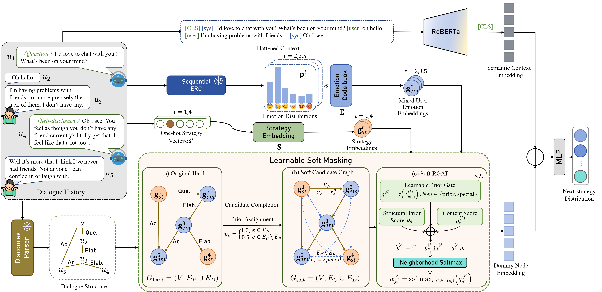

# Learnable Soft Masking (LSM)

This repository contains the official implementation of **Learnable Soft
Masking (LSM)**. It compares the original hard discourse constraint with our
learnable soft constraint on ESConv and AnnoMI.

<p align="center">
  
</p>

The public benchmark has exactly four conditions:

| Dataset | Variant | Implementation name | Save as | Checkpoint download |
|---|---|---|---|---|
| ESConv | Hard | `original_hard` | `checkpoints/esconv/hard/best.pth` | [Google Drive](https://drive.google.com/file/d/1OTlCZNhFgj5-4gS23-wzftTp-WNvz6K0/view?usp=drive_link) |
| ESConv | Soft (LSM) | `learnable_soft` | `checkpoints/esconv/soft/best.pth` | [Google Drive](https://drive.google.com/file/d/1QkUlTDsGokYAnbiGHYFbpEhZiyts4dlv/view?usp=drive_link) |
| AnnoMI | Hard | `original_hard` | `checkpoints/annomi/hard/best.pth` | [Google Drive](https://drive.google.com/file/d/1TeDtGb5YbrY8pYuPKlvpbhOFPwdr71bq/view?usp=drive_link) |
| AnnoMI | Soft (LSM) | `learnable_soft` | `checkpoints/annomi/soft/best.pth` | [Google Drive](https://drive.google.com/file/d/1ydzyLMZmRIPtkRYFweNehxU_8rAaaHVt/view?usp=drive_link) |

Download each file and save it as `best.pth` at the path shown in the fourth
column.

## Quick reproduction

Requirements: Python 3.10, a CUDA-capable GPU, and Bash (Linux/macOS, WSL, or
Git Bash on Windows).

```bash
git clone https://github.com/RobotChen21/learnable-soft-masking.git
cd LSM
conda create -n lsm python=3.10 -y
conda activate lsm
python -m pip install -r requirements.txt
```

Download the four checkpoints from the table above and save each one at its
specified path.

Download the complete [pre-trained models folder](https://drive.google.com/drive/folders/1rTc7AdCF9auulBMG60z2MQVGKVjgEr4Y?usp=drive_link), then place it in the
repository root with this exact layout:

```text
pre_trained_models/
├── sddp_stac/
│   ├── config.json
│   ├── pytorch_model.bin
│   └── tokenizer.json
└── sequential_erc_model.pth
```

Generate the preprocessed datasets from the included raw data:

```bash
python preprocess.py esconv
python preprocess.py annomi
```

Verify that all required runtime files now exist:

```text
checkpoints/esconv/hard/best.pth
checkpoints/esconv/soft/best.pth
checkpoints/annomi/hard/best.pth
checkpoints/annomi/soft/best.pth
data/esconv_preprocessed/{train,valid,test}.pkl
data/annomi_preprocessed/{train,valid,test}.pkl
```

### Evaluate all four checkpoints

Run the following command to quickly evaluate the Hard and LSM checkpoints on
both ESConv and AnnoMI:

```bash
python scripts/run_experiments.py --mode test
```

The equivalent Bash wrapper is:

```bash
bash scripts/reproduce.sh
```

This evaluates all four checkpoints in sequence. The comparison table is saved
to `runs/benchmark/summary.csv`; detailed results are under
`runs/benchmark/{dataset}/{variant}/seed-114514/logs/`. To select a subset:

```bash
python scripts/run_experiments.py --mode test --dataset esconv --variant soft
```

Use `--dry-run` to print all commands without loading a model.

## Training all four models

Canonical hyperparameters live in `configs/experiments.json`; the runner is the
single public experiment entry point.

```bash
bash scripts/train_all.sh
```

For one condition:

```bash
python scripts/run_experiments.py --mode train --dataset annomi --variant hard
```

Training outputs go to `runs/benchmark/`. Copy each selected validation-best
checkpoint to its public `best.pth` path before publishing the release.

## Data and frozen submodules

Training and evaluation use these generated splits:

```text
data/esconv_preprocessed/{train,valid,test}.pkl
data/annomi_preprocessed/{train,valid,test}.pkl
```

To regenerate them, download the complete [pre-trained models folder](https://drive.google.com/drive/folders/1rTc7AdCF9auulBMG60z2MQVGKVjgEr4Y?usp=drive_link) and place it at
`pre_trained_models/`, then run:

```bash
python preprocess.py esconv
python preprocess.py annomi
```

Processed files and all weights are ignored by Git. Reproducers generate the
processed splits locally from the included raw data and released frozen models.

## Repository layout

```text
configs/                 canonical experiment hyperparameters
checkpoints/             four public checkpoint slots (weights not in Git)
data/                    raw data and generated preprocessed splits
dataloaders/             dataset implementations
modules/                 model and trainer code
scripts/reproduce.sh     one-command evaluation of all four conditions
scripts/train_all.sh     one-command training of all four conditions
scripts/run_experiments.py shared train/test runner
tests/                   unit tests
runs/                    generated logs and checkpoints (ignored)
```

## Acknowledgements and license

This implementation builds on prior open-source research code. Preserve the
applicable upstream notices and consult [LICENSE](LICENSE), plus the licenses
and terms of both datasets, before redistributing raw or processed data.
